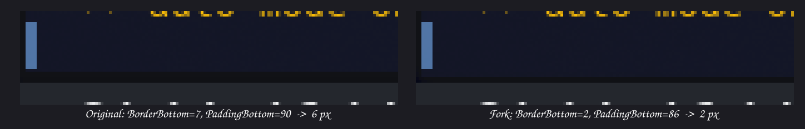

# Aurorae Slim Themes

**What this fixes:** on the original **Carl** and **Scratchy** Aurorae window
decorations, the bottom border of every window is drawn about three times
thicker than the side borders (6 px against 2 px), which makes windows look
bottom-heavy. These forks make the bottom border match the sides. Nothing else
changes: same artwork, same colors, same buttons, same title bar.



Original themes by **jomada** (gicalucejo@gmail.com), licensed GPL v3. These
forks keep the same license. No artwork was modified, only two layout values.

*(Version en castellano mas abajo.)*

## The problem

On these themes the bottom border of every window looks much thicker than the
side borders: 6 px at the bottom against 2 px at the sides.

The cause is not just `BorderBottom`. The theme's `decoration.svg` paints an
opaque dark band **inside the padding area**, the region that is supposed to
hold the drop shadow. That band shifts vertically with `PaddingBottom`, so it
spills below the window frame and adds to the real border. This is why lowering
`BorderBottom` on its own changes nothing you can see.

## The fix

Two values in the `[Layout]` section of the theme's rc file:

| Key | Original | Fork |
|---|---|---|
| `BorderLeft` | 2 | 2 |
| `BorderRight` | 2 | 2 |
| `BorderBottom` | 7 | **2** |
| `PaddingBottom` | 90 | **86** |

`PaddingBottom` was calibrated by measuring pixels on screen:

| `PaddingBottom` | Visible bottom border |
|---|---|
| 90 | 6 px |
| 88 | 4 px |
| **86** | **2 px, same as the sides** |
| 84 or lower | the border disappears entirely |

If you change `BorderBottom`, you have to recalibrate `PaddingBottom`.

## Install

```bash
git clone https://github.com/zebus3d/aurorae-slim-themes.git
cd aurorae-slim-themes
./install.sh
```

Then pick **CarlSlim** or **ScratchySlim** in
*System Settings > Colors & Themes > Window Decorations*.

The installer only copies into `~/.local/share/aurorae/themes/`. It does not
touch the original themes, so you can switch back at any time.

## Two traps when tweaking these files

**1. KWin caches the theme rc in memory.** Running
`qdbus6 org.kde.KWin /KWin reconfigure` does *not* re-read it. You have to
switch to another theme and back:

```bash
sw() { kwriteconfig6 --file kwinrc --group org.kde.kdecoration2 --key theme "__aurorae__svg__$1"; qdbus6 org.kde.KWin /KWin reconfigure; sleep 2; }
sw Breeze; sw CarlSlim
```

**2. The global KDE "Border size" setting clamps these values.** It lives in
`~/.config/kwinrc`, group `org.kde.kdecoration2`, key `BorderSize`. With `Tiny`
the cap is 4 px, so writing 25 in the theme does nothing. These forks are tuned
for `BorderSize=Tiny`.

## Measuring borders properly

Eyeballing a screenshot is misleading, mostly because the SVG band falls
*outside* the window frame. Ask KWin instead, comparing `frameGeometry` with
`clientGeometry`. A ready-to-use script ships in each theme folder as
`borders.js`:

```bash
id=$(qdbus6 org.kde.KWin /Scripting org.kde.kwin.Scripting.loadScript ~/.local/share/aurorae/themes/CarlSlim/borders.js probe)
qdbus6 org.kde.KWin /Scripting/Script$id org.kde.kwin.Script.run
qdbus6 org.kde.KWin /Scripting org.kde.kwin.Scripting.unloadScript probe
journalctl --user -b --since "-20s" | grep BORDERS
```

That gives the real frame border. The SVG band sits outside it and only shows up
when you measure pixels on a full-screen capture.

## Tested on

KDE Plasma 6 on Wayland, Arch Linux, `BorderSize=Tiny`, display scale 1.

---

# En castellano

**Que arregla:** en los temas originales **Carl** y **Scratchy** el borde
inferior de las ventanas se dibuja unas tres veces mas grueso que los laterales,
6 px frente a 2 px, y las ventanas quedan como cargadas por abajo. Estos forks
igualan el borde de abajo al de los lados. No cambia nada mas: mismo dibujo,
mismos colores, mismos botones, misma barra de titulo.

## El problema

El borde de abajo se ve mucho mas grueso que los de los lados: 6 px frente a
2 px. La causa no es solo `BorderBottom`. El archivo `decoration.svg` pinta una
banda oscura opaca dentro de la zona de *padding*, la que en teoria se reserva
para la sombra. Esa banda se desplaza segun `PaddingBottom`, se cuela por debajo
del marco y se suma al borde real. Por eso bajar solo `BorderBottom` no cambia
nada visible.

## La solucion

Dos valores en la seccion `[Layout]`: `BorderBottom` de 7 a 2, y `PaddingBottom`
de 90 a 86. El 86 esta calibrado midiendo pixeles: con 88 quedan 4 px, con 84 o
menos el borde desaparece del todo.

## Instalacion

```bash
git clone https://github.com/zebus3d/aurorae-slim-themes.git
cd aurorae-slim-themes
./install.sh
```

Luego elige **CarlSlim** o **ScratchySlim** en *Preferencias del sistema >
Colores y temas > Decoraciones de ventana*. Los temas originales no se tocan.

## Dos trampas al probar cambios

KWin **cachea** el rc del tema, asi que `reconfigure` no basta: hay que cambiar a
otro tema y volver. Y el ajuste global **Tamano de borde** de KDE recorta estos
valores, con tope de 4 px cuando esta en `Tiny`.

## Creditos

Temas originales de **jomada**. Publicados bajo GPL v3, igual que estos forks.
